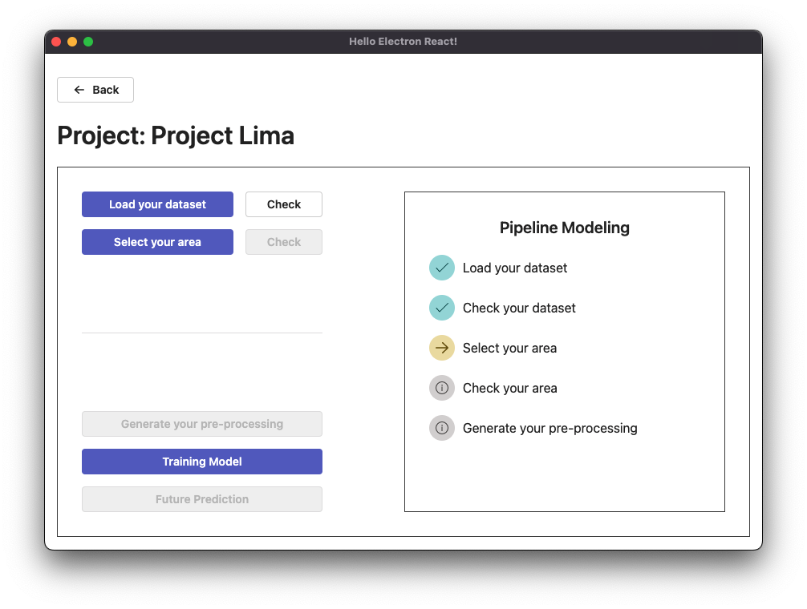

## Prerequisite
- [Install NodeJS](https://nodejs.org/en/download/package-manager)
- [Install Python](https://www.python.org/)
- Code Editor

## Disclaimer
- I only tested (install, developing, packaging, running) it on MacOS environment
- I never tested it on other OS (Windows, Linux, etc)
- Questions related to OS other than MacOS, please "google" it :sweat_smile:

## Development
- You need to clone the repo, then install and run Node and Python application.
- Also, you may need 2 terminals (one for NodeJS and Python)

## Structure
```sh
# Python development
=> /src/engine
# Python compiled
=> /assets/engine
# React / display development
=> /src/renderer
```

### 1. Clone Repository
```bash
# clone this repository with ssh
git clone git@github.com:mnovalbs/pydesk.git

# or with https
git clone https://github.com/mnovalbs/pydesk.git

# enter directory
cd pydesk
```

### 2. Install Python Depedencies
```bash
# go to python directory
cd src/engine

# activate python virtual env
source .venv/bin/activate

# install depedencies
pip install -r requirements.txt
```

### 2 Run Python Application
```bash
python3 main.py
# or 
python main.py
```

### 3. Install NodeJS Depedencies
```bash
yarn install
# or with npm
npm install
```

### 4. Run ElectronJS
```bash
yarn start
# or with npm
npm run start
```

## Packaging for Production

### Compile your python
```bash
# to development working directory
cd src/engine

# compile to one file
pyinstaller --onefile main.py

# copy to production binary assets directory
cp dist/main ../../assets/engine/main
```

### Packaging Electron

```bash
yarn package
# or with npm
npm run package
```

your package will be built under `release/build` directory
